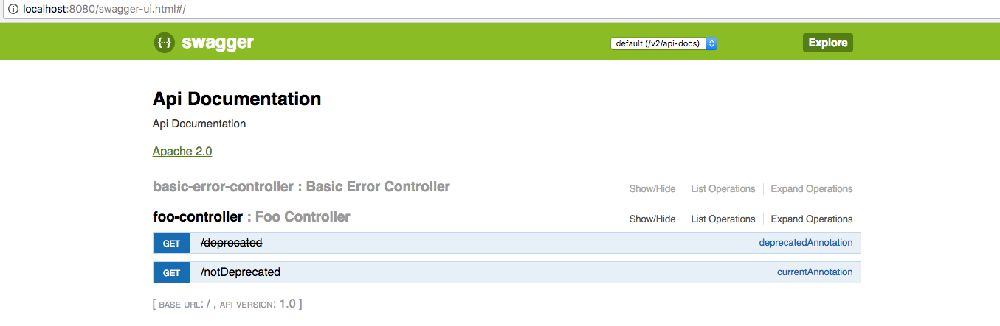

# SpringFox Swagger Deprecation Sample
When a controller endpoint is decorated with an annotation that has been deprecated,
the endpoint itself is marked as being deprecated.

# How to Run
1. Clone https://github.com/robzahm/springfox
2. Start application via ```gradle bootRun```
3. Access http://localhost:8080/swagger-ui.html
4. Expand Foo Controller, note that one endpoint appears deprecated, and the other does not.
5. Look in the source ```Controller``` package, and note that the ```deprecated``` endpoint itself has not been deprecated, but does have an annotation that has been deprecated.

# Output

This can be seen in the swagger_ui.png screen capture and swagger.json sample json
generated from this project (the endpoint with the deprecated annotation contains a
**"deprecated": true** designation).



```json
{
  "swagger": "2.0",
  "info": {
    "description": "Api Documentation",
    "version": "1.0",
    "title": "Api Documentation",
    "termsOfService": "urn:tos",
    "contact": {},
    "license": {
      "name": "Apache 2.0",
      "url": "http://www.apache.org/licenses/LICENSE-2.0"
    }
  },
  "host": "localhost:8080",
  "basePath": "/",
  "tags": [
    {
      "name": "foo-controller",
      "description": "Foo Controller"
    },
    {
      "name": "basic-error-controller",
      "description": "Basic Error Controller"
    }
  ],
  "paths": {
    "/deprecated": {
      "get": {
        "tags": [
          "foo-controller"
        ],
        "summary": "deprecatedAnnotation",
        "operationId": "deprecatedAnnotationUsingGET",
        "consumes": [
          "application/json"
        ],
        "produces": [
          "*/*"
        ],
        "responses": {
          "200": {
            "description": "OK"
          },
          "401": {
            "description": "Unauthorized"
          },
          "403": {
            "description": "Forbidden"
          },
          "404": {
            "description": "Not Found"
          }
        },
        "deprecated": true
      }
    },
    "/error": {
      "get": {
        "tags": [
          "basic-error-controller"
        ],
        "summary": "error",
        "operationId": "errorUsingGET",
        "consumes": [
          "application/json"
        ],
        "produces": [
          "*/*"
        ],
        "responses": {
          "200": {
            "description": "OK",
            "schema": {
              "type": "object",
              "additionalProperties": {
                "type": "object"
              }
            }
          },
          "401": {
            "description": "Unauthorized"
          },
          "403": {
            "description": "Forbidden"
          },
          "404": {
            "description": "Not Found"
          }
        }
      },
      "head": {
        "tags": [
          "basic-error-controller"
        ],
        "summary": "error",
        "operationId": "errorUsingHEAD",
        "consumes": [
          "application/json"
        ],
        "produces": [
          "*/*"
        ],
        "responses": {
          "200": {
            "description": "OK",
            "schema": {
              "type": "object",
              "additionalProperties": {
                "type": "object"
              }
            }
          },
          "204": {
            "description": "No Content"
          },
          "401": {
            "description": "Unauthorized"
          },
          "403": {
            "description": "Forbidden"
          }
        }
      },
      "post": {
        "tags": [
          "basic-error-controller"
        ],
        "summary": "error",
        "operationId": "errorUsingPOST",
        "consumes": [
          "application/json"
        ],
        "produces": [
          "*/*"
        ],
        "responses": {
          "200": {
            "description": "OK",
            "schema": {
              "type": "object",
              "additionalProperties": {
                "type": "object"
              }
            }
          },
          "201": {
            "description": "Created"
          },
          "401": {
            "description": "Unauthorized"
          },
          "403": {
            "description": "Forbidden"
          },
          "404": {
            "description": "Not Found"
          }
        }
      },
      "put": {
        "tags": [
          "basic-error-controller"
        ],
        "summary": "error",
        "operationId": "errorUsingPUT",
        "consumes": [
          "application/json"
        ],
        "produces": [
          "*/*"
        ],
        "responses": {
          "200": {
            "description": "OK",
            "schema": {
              "type": "object",
              "additionalProperties": {
                "type": "object"
              }
            }
          },
          "201": {
            "description": "Created"
          },
          "401": {
            "description": "Unauthorized"
          },
          "403": {
            "description": "Forbidden"
          },
          "404": {
            "description": "Not Found"
          }
        }
      },
      "delete": {
        "tags": [
          "basic-error-controller"
        ],
        "summary": "error",
        "operationId": "errorUsingDELETE",
        "consumes": [
          "application/json"
        ],
        "produces": [
          "*/*"
        ],
        "responses": {
          "200": {
            "description": "OK",
            "schema": {
              "type": "object",
              "additionalProperties": {
                "type": "object"
              }
            }
          },
          "204": {
            "description": "No Content"
          },
          "401": {
            "description": "Unauthorized"
          },
          "403": {
            "description": "Forbidden"
          }
        }
      },
      "options": {
        "tags": [
          "basic-error-controller"
        ],
        "summary": "error",
        "operationId": "errorUsingOPTIONS",
        "consumes": [
          "application/json"
        ],
        "produces": [
          "*/*"
        ],
        "responses": {
          "200": {
            "description": "OK",
            "schema": {
              "type": "object",
              "additionalProperties": {
                "type": "object"
              }
            }
          },
          "204": {
            "description": "No Content"
          },
          "401": {
            "description": "Unauthorized"
          },
          "403": {
            "description": "Forbidden"
          }
        }
      },
      "patch": {
        "tags": [
          "basic-error-controller"
        ],
        "summary": "error",
        "operationId": "errorUsingPATCH",
        "consumes": [
          "application/json"
        ],
        "produces": [
          "*/*"
        ],
        "responses": {
          "200": {
            "description": "OK",
            "schema": {
              "type": "object",
              "additionalProperties": {
                "type": "object"
              }
            }
          },
          "204": {
            "description": "No Content"
          },
          "401": {
            "description": "Unauthorized"
          },
          "403": {
            "description": "Forbidden"
          }
        }
      }
    },
    "/notDeprecated": {
      "get": {
        "tags": [
          "foo-controller"
        ],
        "summary": "currentAnnotation",
        "operationId": "currentAnnotationUsingGET",
        "consumes": [
          "application/json"
        ],
        "produces": [
          "*/*"
        ],
        "responses": {
          "200": {
            "description": "OK"
          },
          "401": {
            "description": "Unauthorized"
          },
          "403": {
            "description": "Forbidden"
          },
          "404": {
            "description": "Not Found"
          }
        }
      }
    }
  },
  "definitions": {
    "ModelAndView": {
      "type": "object",
      "properties": {
        "empty": {
          "type": "boolean"
        },
        "model": {
          "type": "object"
        },
        "modelMap": {
          "type": "object",
          "additionalProperties": {
            "type": "object"
          }
        },
        "reference": {
          "type": "boolean"
        },
        "status": {
          "type": "string",
          "enum": [
            "100",
            "101",
            "102",
            "103",
            "200",
            "201",
            "202",
            "203",
            "204",
            "205",
            "206",
            "207",
            "208",
            "226",
            "300",
            "301",
            "302",
            "303",
            "304",
            "305",
            "307",
            "308",
            "400",
            "401",
            "402",
            "403",
            "404",
            "405",
            "406",
            "407",
            "408",
            "409",
            "410",
            "411",
            "412",
            "413",
            "414",
            "415",
            "416",
            "417",
            "418",
            "419",
            "420",
            "421",
            "422",
            "423",
            "424",
            "426",
            "428",
            "429",
            "431",
            "451",
            "500",
            "501",
            "502",
            "503",
            "504",
            "505",
            "506",
            "507",
            "508",
            "509",
            "510",
            "511"
          ]
        },
        "view": {
          "$ref": "#/definitions/View"
        },
        "viewName": {
          "type": "string"
        }
      }
    },
    "View": {
      "type": "object",
      "properties": {
        "contentType": {
          "type": "string"
        }
      }
    }
  }
}

```
